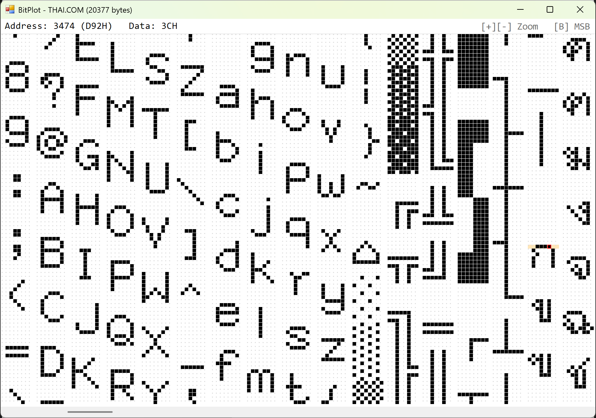
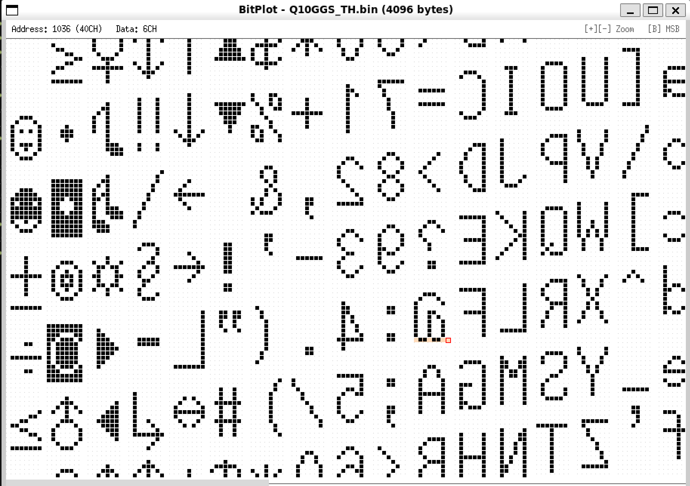

# BitPlot

**View any file as a bitmap of its bits — 1 byte = 8 pixels.**

A tiny Windows & Linux tool for finding bitmap fonts embedded inside programs, firmware and ROM dumps — or for eyeballing any raw binary data. Think of it as a hex dump drawn as pixels: structure and patterns (especially glyphs) jump out visually instead of hiding in a wall of hex numbers.



## Download

**Windows:** grab the prebuilt `BitPlot.exe` from [**Releases**](https://github.com/too101/bitplot/releases/latest) — it's a single portable file, no installation needed (Windows 8.1/10/11 have everything built in).

**Linux:** build from source with one command (see [Build](#build)) — at runtime it only needs libX11, which every desktop already has.

## How a file is drawn

- Every byte becomes **8 points, most-significant bit on the left**. A `1` bit is a black square, a `0` bit is a faint dot — like `#` and `.` in a hex dump.
- Bytes fill **downward**, one byte per row. When a column reaches the bottom of the window, plotting continues at the **top of the next byte-column**, leaving a 1-point gap between columns — like text flowing down newspaper columns.
- Hover any point and the header shows the **file address of its byte** in decimal and hex plus the byte's value: `Address: 1234 (4D2H)   Data: 66H`.

Example — a file containing `00 01 02 03 04` renders as:

```
Address: 0 (0H)   Data: 00H
........
.......#
......#.
......##
.....#..
```

## Hunting embedded bitmap fonts

Classic bitmap fonts (8×8 and 8×16 PC/BIOS fonts, game fonts, UI fonts baked into firmware) store **one glyph row per byte**, 8 pixels per byte. Plot such a file and the glyph rows line up with the byte columns — the letters become readable. The screenshot above is `THAI.COM`, a classic DOS-era Thai bitmap font: Latin letters, Thai glyphs and symbol tables all pop out of the raw bytes.

Typical things to point it at:

- firmware / ROM dumps and flash images
- `.exe` / `.dll` / game data files with baked-in fonts
- video BIOS, embedded UI font blobs, raw `.fnt` files
- anything where you suspect 1-bpp graphics

Tips:

- Zoom with `+` / `-` until the column height is a **multiple of the glyph height** (8 or 16 rows), so every glyph starts at the top of a column and stays aligned.
- Some font versions store each row LSB-first, so every glyph looks mirrored. Press `B` to flip the bit order (MSB ⇄ LSB).
- Use the hover address readout to note where a font starts, then extract it at that offset.
- Files wider than the window scroll horizontally; the window can be resized freely (rows per column follow the window height).

## Usage

```
BitPlot.exe [file]      # Windows
./bitplot [file]        # Linux
```

Windows: drag & drop a file onto the window, or press `O` to open one.
Linux: press `O`, type a path, press `Enter`.

| Key | Action |
| --- | --- |
| `O` | open a file |
| `+` / `-` (or `Ctrl` + mouse wheel) | zoom point size |
| mouse wheel, `Left` / `Right` | scroll |
| `Home` / `End` | jump to start / end (Linux) |
| `B` | flip bit order MSB ⇄ LSB (fixes mirrored glyphs) |
| `Esc` | quit (`q` also works on Linux) |

### Linux

Same plotting rules, same hover address readout:



## Build

**Windows** — no dependencies beyond Windows itself; any Windows 7–11 with .NET Framework 4.x (preinstalled) has the compiler already:

```
C:\Windows\Microsoft.NET\Framework64\v4.0.30319\csc.exe /nologo /target:winexe /out:BitPlot.exe BitPlot.cs
```

**Linux** — a single-file C program using plain X11:

```
gcc -O2 -Wall -o bitplot bitplot.c -lX11      # or just: make
```

Building needs `gcc` and the X11 headers — Debian/Ubuntu: `sudo apt install build-essential libx11-dev`, Fedora: `sudo dnf install gcc libX11-devel`. At runtime only libX11 is required; it comes preinstalled on every desktop, and on Wayland the app runs through XWayland.

## Files

| File | Description |
| --- | --- |
| `BitPlot.cs` | Windows build — the whole program in one file (C# WinForms) |
| `bitplot.c` | Linux build — the whole program in one file (C, X11) |
| `Makefile` | `make` builds the Linux binary |
| `font-demo.bin` | hand-made 8×8 bitmap font spelling `BITPLOT` — open it and see the letters |
| `test.bin` | the `00 01 02 03 04 …` example from above |

---

## ภาษาไทย

**BitPlot** คือเครื่องมือเล็กๆ บน Windows และ Linux สำหรับเปิดไฟล์อะไรก็ได้มาแสดงเป็นบิตแมป — **1 byte = 8 จุด** โดยไบต์จะเรียงลงมาทีละแถว พอถึงล่างสุดของหน้าต่างจะไหลขึ้นไปเริ่มที่บนสุดของคอลัมน์ถัดไป (เว้นช่องว่าง 1 จุด) เหมือนตัวอักษรไหลลงคอลัมน์หนังสือพิมพ์

จุดประสงค์หลักคือใช้**ตามหาฟอนต์ bitmap ที่ฝังอยู่ในโปรแกรม เฟิร์มแวร์ หรือไฟล์เกม** หรือใช้ดูไฟล์ bitmap font โดยตรง เพราะฟอนต์ยุคคลาสสิก (8×8, 8×16) เก็บแต่ละแถวของ glyph เป็น 1 byte = 8 พิกเซล พอ plot ออกมาตัวอักษรจะอ่านได้ทันทีตามในภาพตัวอย่าง (ไฟล์ `THAI.COM` ฟอนต์ไทยยุค DOS)

- ดาวน์โหลดโปรแกรมสำเร็จรูปได้ที่หน้า [Releases](https://github.com/too101/bitplot/releases/latest) (ไฟล์เดียว พกพาสะดวก ไม่ต้องติดตั้งอะไร)
- เอาเมาส์ชี้จุดไหนก็จะบอก **address ของ byte นั้น (ฐาน 10 และฐาน 16) พร้อมค่าของ byte** เช่น `Address: 1234 (4D2H)   Data: 66H`
- `O` = เปิดไฟล์ (Windows ลากไฟล์มาทิ้งก็ได้, Linux กด `O` แล้วพิมพ์ path), `+` / `-` = ซูมขนาดจุด, ลูกกลิ้งเมาส์ = เลื่อนซ้ายขวา
- ฟอนต์บางรุ่นเก็บบิตกลับซ้ายขวา (LSB-first) ทำให้ตัวอักษรกลับด้าน — กด `B` เพื่อสลับ MSB ⇄ LSB
- มีสองเวอร์ชัน: Windows (C# WinForms ไฟล์เดียว) และ Linux (C + X11 ไฟล์เดียว) — ไม่มี dependency ให้ติดตั้งเพิ่ม วิธี build อยู่ในหัวข้อ Build
